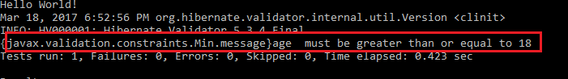

### Bean Validation ###
The Java API(`javax.validation.constraints`) for JavaBeans Validation (Bean Validation) provides a mechanism for validating application data.
Bean Validation specification JSR No 303 and introduce from jdk 6

Prior to JSR 303, you probably would have needed a bunch of if-else statements to achieve the bean validation.It saves lot of code.

reference implementation of 303 named `Hibernate Validator`

JSR 349 extend jsr 303 provides for variable interpolation, allowing expressions inside the violation messages

reference implementation of 349 named `GlassFish el`
 
### Warmup ###

1. create maven java project by following command

	`mvn archetype:generate -DgroupId=com.javaaround -DartifactId=Jpa -DarchetypeArtifactId=maven-archetype-quickstart -DinteractiveMode=false`

2. Update AppTest.java
	```java
	package com.javaaround;

	import org.junit.Test;;

	
	/**
	 * Unit test for simple App.
	 */
	public class AppTest {
	   @Test
	   public void AppTest( ){
	        App.main(null);
	   }
	}
	```

3. Update junit version at pom.xml

	```xml
	<version>4.8.1</version>
	```

4. Run app by following command

	`mvn clean package`


### Example Demo ###

1. Add hibernate-validator(provide also Bean Validator API) at pom.xml
	```xml
	<!-- 
	No need because it is included hibernate-validator
	<dependency>
	    <groupId>javax.validation</groupId>
	    <artifactId>validation-api</artifactId>
	    <version>1.1.0.Final</version>
	</dependency> 
	-->
	<dependency>
	    <groupId>javax.el</groupId>
	    <artifactId>javax.el-api</artifactId>
	    <version>2.2.4</version>
	</dependency>
	<dependency>
	    <groupId>org.hibernate</groupId>
	    <artifactId>hibernate-validator</artifactId>
	    <version>5.3.4.Final</version>
	</dependency>
	<!-- Needed by hibernate-validator to substitute params in messages: -->
	<dependency>
	    <groupId>org.glassfish.web</groupId>
	    <artifactId>javax.el</artifactId>
	    <version>2.2.4</version>
	    <scope>runtime</scope>
	</dependency>
	```

2. Create a bean(Employee.java)

	```java
	package com.javaaround.model;
	import javax.validation.constraints.DecimalMax;
	import javax.validation.constraints.NotNull;
	import javax.validation.constraints.Size;

	public class Employee { 
	    private int id;

	    @NotNull
	    @Size(max = 25,min = 5)  
	    private String firstName;
		@DecimalMax(value = "50000.00")
	    private Double salary;  

	    
	}   
	``` 

	Explantion :
 
	1. @NotNull :

		The value of the property must not be null.Unfortunately it doesn't check for empty string values.For this reason hibernate introduce two new contraints(not yet JPA)

		1. @NotBlank :  The string is not null and the trimmed length is greater than zero.
		2. @NotEmpty : The String, Collection, Map or Array object is not null and size > 0.

		```java
		String name = "";
		@NotNull: true
		@NotEmpty: false
		@NotBlank: false

		but 

		String name = " "; //space
		@NotNull: true
		@NotEmpty: true
		@NotBlank: false
		```

		@Null : The value of the property must be null.


	2. @Size :

		1. If the property is a String, the size of the string is evaluated. 
		2. If the property is a Collection, the size of the Collection is evaluated. 
		3. If the property is a Map, the size of the Map is evaluated. 
		3. If the property is an array, the size of the array is evaluated.

		Use one of the optional `max or min` elements to specify the boundaries.

		equivalent Hibernate specific annotation of @size

		1. `@Length(min=, max=)` only used for string 
		2. `@Range(min=, max=)` BigDecimal, BigInteger, CharSequence, byte, short, int, long and the respective wrappers of the primitive types

	3. @DecimalMax :

		The value of the property must be a decimal value lower than or equal to the number in the `value` element. Similarway `@Max` for interger

	4. @DecimalMin :

		The value of the property must be a decimal value greater than or equal to the number in the `value` element.	Similarway `@Min` for interger

	Note : if the class uses field access type, apply the Bean Validation constraint annotations on the class’s fields. If the class uses property access, apply the constraints on the getter methods.

3. Update App.java

	```java
	Employee employee = new Employee();
	employee.setId(122);
	employee.setSalary(60000.00);
	ValidatorFactory factory = Validation.buildDefaultValidatorFactory();
	Validator validator = factory.getValidator();
	/*
	//If there are multiple JSR303 implementations in classpath
		//we can get HibernateValidator specifically too
		ValidatorFactory hibernateVF = Validation.byProvider(HibernateValidator.class)
									.configure().buildValidatorFactory();
	*/
	
	Set<ConstraintViolation<Employee>> constraints = validator
		.validate(employee);
	if (constraints.isEmpty()) {
		System.out.print("valid data");
	}else{	
		for (ConstraintViolation<Employee> constraint : constraints) {
			System.out.println(constraint.getMessageTemplate() + constraint.getPropertyPath() + "  "
			+ constraint.getMessage());
		}
	}
	```

	Explanation

	1. getMessageTemplate() :  return message key 
	2. getPropertyPath() :  return error field/property name
	3. getMessage() :  return error message

4. Run app

 


### @AssertTrue,@Future,@Past ###

1. Update Employee.java

	```java
	@AssertTrue
	boolean active; 

	@Future
	Date arrageDate;

	@Past
	Date birthday;
	```


	Explantion :
 
	1. @AssertTrue :
		The value of the property must be true where as <br>@AssertFalse The value of the property must be false

	2. @Past : 
		The value of the property must be a date in the past.
	3. @Future : 
		The value of the property must be a date in the future.

2. Update App.java

	```java
	employee.setActive(false);
	try {
	 	employee.setArrageDate(new Date());
	    employee.setBirthday(formatter.parse("2017-04-02"));

	} catch (ParseException e) {
	    e.printStackTrace();
	}
			
	```	

Run app

 


### @Digits,@Pattern ###

1. Update Employee.java

	```java
	//Age can only be 2 digits long or less
	@Digits(integer=2, fraction=0)
	private int age;

	@Pattern(regexp=".+@.+\\.[a-z]+")
	private String email;
	```

	Explantion :
	 
	1. @Digits : 
			The value of the property specifies the maximum `integer` digits and `fraction` element specifies the maximum fractional digits for the number.

	2. @Pattern : 
			The value of the field or property must match the regular expression defined in the `regexp` element.

2. Upadate App.java

	```java
	employee.setAge(100);
	employee.setEmail("shamim.ict0754gmail.com");
	```

Run app

 


### @Valid ###

Performs validation recursively on the associated object if the object is a collection or an array or map or composition object

1. Create EmployeeDetails.java

	```java
	package com.javaaround.model;
	import lombok.Data;
	import javax.validation.constraints.NotNull;
	import org.hibernate.validator.constraints.NotEmpty;
	@Data
	public class EmployeeDetails { 
		private int id;
		@NotEmpty
		private String city;
		@NotNull
		private String fatherName;


	}	
	```
2. Update Employee.java

	```java
	import javax.validation.Valid;
	@Valid
    private EmployeeDetails empDetails;
	```
3. Update App.java

	```java
	Employee employee = new Employee();
    employee.setAge(100);
 	employee.setEmail("shamim.ict0754gmail.com");

 	EmployeeDetails empDetails = new EmployeeDetails();
 	empDetails.setCity("");
 	empDetails.setFatherName("Md.Shamsul Alam");

 	employee.setEmpDetails(empDetails);
	```
Run app

 


Another demo on collection object

1. Create Address.java

	```java
	package com.javaaround.model;
	import javax.validation.constraints.NotNull;
	import org.hibernate.validator.constraints.NotEmpty;
	import lombok.Data;

	@Data 
	public class Address { 
		@NotEmpty
		private String street;
		@NotEmpty
		private String city;
		@NotNull
		private String postcode;

	}	
	```
2. Update Employee.java

	```java
	@Valid
    private List<Address> addressList;
	```
3. Update App.java

	```java
	Employee employee = new Employee();
    employee.setAge(100);
 	employee.setEmail("shamim.ict0754gmail.com");

 	Address add1 = new Address();
 	add1.setStreet("");
 	add1.setCity("Tangail");
 	add1.setPostcode("1900");

 	Address add2 = new Address();
 	add1.setStreet("1220");
 	add1.setCity("Tangail");
 	add1.setPostcode(null);
 	List<Address> addressList = new ArrayList<Address>();
 	addressList.add(add1);
 	addressList.add(add2);
 	employee.setAddressList(addressList);
	```
Run app

 


### Hibnerate specific constraints ###

In addition to the constraints defined above by the Bean Validation API . Hibernate Validator provides several useful custom constraints.That are described below

1. Update Employee.java
	```java
	import org.hibernate.validator.constraints.Email;
	import org.hibernate.validator.constraints.SafeHtml;
	import org.hibernate.validator.constraints.URL;
	@Email
    private String email;
    @SafeHtml
    private String remarks;

    @URL
    private String profileLink;
	```

	Explantion :
	 
	1. @Email : 
			Check a string is a valid email

	2. @SafeHtml : 

			In order to use it need to add jsoup library so add following dependency at pom.xml

			```xml
			<groupId>org.jsoup</groupId>
		        <artifactId>jsoup</artifactId>
		        <version>1.8.3</version>
		    </dependency>
			```

			Checks it contains no malicious code such as <script/>.By default it allow all html tag such as b, blockquote, br, caption, cite, code, col, colgroup, dd, dl, dt, em, h1, h2, h3, h4, h5, h6, i, img etc. You can customize it by `whitelistType` and `additionalTags` and `additionalTagsWithAttributes`

			1. whitelistType :  value  allow of enum `WhiteListType`

				1. WhiteListType.NONE = This whitelist allows only text nodes: all HTML will be stripped.
				2. WhiteListType.SIMPLE_TEXT = allows only simple text formatting: b, em, i, strong, u
				3. WhiteListType.BASIC = allows a fuller range of text nodes but not img tag
				4. WhiteListType.BASIC_WITH_IMAGES = allows a fuller range of text nodes + img tag
				5. WhiteListType.RELAXED = allows a full range of text and structural body HTML.This is default

				```java
				@SafeHtml(whitelistType = WhiteListType.NONE)
				```

			2. additionalTags & additionalTagsWithAttributes : allows to add tags without any attributes hereas the latter allows to specify tags and optionally allowed attributes using the annotation `@SafeHtml.Tag`.
			
				```java
				@SafeHtml(whitelistType = WhiteListType.NONE,additionalTags={@SafeHtml.Tag(name = "p")},additionalTagsWithAttributes={@SafeHtml.Tag(name = "p",attributes = { "style" })})
				```	
	3. @URL : checks valid URL according to RFC2396 . by default it is used the java.net.URL constructor to verify whether a given string represents a valid URL.You can customize it like hostname,port etc
	
		1. protocol : define protocol that is check		
		2. host : define host that is check		
		3. port : define port that is check		
		3. regexp : specify an regular expression (including regular expression flags) which the URL must match	

2. Update App.java

	```java
	employee.setEmail("shamim.ict0754gmailcom");
 	employee.setRemarks("<script>alert('')</script");
 	//employee.setRemarks("<p>alert('')</p");
 	employee.setProfileLink("https");

	```	
Run app

 


### Customizing Validator Messages ###

Update Employee.java

```java
//Age can only be 2 digits long or less
@Digits(integer=2, fraction=0,message="Age must be 2 digits long or less")
private int age;

@Pattern(regexp=".+@.+\\.[a-z]+",message="invalid email")
private String email;
```

Message parameters are string literals enclosed in {contraint param}  e.g {integer} for @Digits

message expressions are string literals enclosed in ${expression}  e.g {integer  > 1 ? 's' : ''}

`${validatedValue}` is a special expression that retrive value

Update Employee.java

```java
@Digits(integer=2, fraction=0,message="${integer  > 1 ? 's' : ''} must be {integer} digits long or less")
private int age;

@Pattern(regexp=".+@.+\\.[a-z]+",message="email.invalid")
private String email;
```

### Separting message from java ###

you can separting message into file(ValidationMessages.properties) from java code.this file contains message-key = message

1. Update Employee.java

	```java
	//Age can only be 2 digits long or less
	@Digits(integer=2, fraction=0)
	private int age;

	@Pattern(regexp=".+@.+\\.[a-z]+",message="{error.invalid_email}")
	@NotNull(message="{error.required}")
	private String email;
	```

	Explantion :
		 
	1. @Digits : 
		if you don't specify message key then it search `message key/message` by <br>following format contraints-namewithpackage.message<br>(e.g javax.validation.constraints.Digits.message)

	2. @Pattern & @NotNull: 
		since here define message key then it search that key into ValidationMessages.properties

2. Create ValidationMessages.properties at src/main/resources

	```properties
	javax.validation.constraints.Digits.message=Age must be 2 digits long or less
	error.invalid_email=Email mustss be match {regexp}
	error.required=Email can't null
	```

Run app	

Default file named ValidationMessages.properties is loaded if you need other name file e.g message.properties

Update App.java

```java
/*ValidatorFactory factory = Validation.buildDefaultValidatorFactory();
Validator validator = factory.getValidator();*/
Validator validator = Validation.byDefaultProvider()
.configure()
.messageInterpolator(
		new ResourceBundleMessageInterpolator(
				new PlatformResourceBundleLocator( "messages" )
		)
)
.buildValidatorFactory()
.getValidator();
```

For Multiple file load

```java
Validator validator = Validation.byDefaultProvider()
		.configure()
		.messageInterpolator(
			new ResourceBundleMessageInterpolator(
				new AggregateResourceBundleLocator(
						Arrays.asList(
								"MyMessages",
								"MyOtherMessages"
						)
				)
			)
		)
		.buildValidatorFactory()
		.getValidator();
```

### Validation with Inheritance ###
	
Bean validations are inherited, so if we are validating object of child class then any validations in parent class will also be executed.

1. Create Person.java

	```java
	package com.javaaround.model;
	import javax.validation.constraints.NotNull;
	import org.hibernate.validator.constraints.NotEmpty;
	import lombok.Data;

	@Data 
	public class Person { 
		@NotEmpty
		private String name;

	}	
	```

2. Create Employee.java

	```java
	@Data
	public class Employee extends Person{ 
	```
3. Update App.java

	```java
	Employee employee = new Employee();
    employee.setName("");
	```
	
Run app


### Method Parameter Validation ###

The validation of method constraints is done using the ExecutableValidator interface.The ExecutableValidator interface offers altogether four methods:
1. validateParameters() and validateReturnValue() for method validation
2. validateConstructorParameters() and validateConstructorReturnValue() for constructor validation

Update Employee.java

```java
public void printData(@NotNull @Size(min=5) String data){
    System.out.println("Data is::"+data);
}
```

App.java

```java
import java.lang.reflect.Method;
import javax.validation.executable.ExecutableValidator;
try{
    //int param validation then int.class
	Method method = Employee.class.getMethod("printData", String.class);
	ExecutableValidator executableValidator = validator.forExecutables();
	Object[] params = {"ab"};
	Set<ConstraintViolation<Employee>> constraints = executableValidator
	.validateParameters(employee, method, params);
	if (constraints.isEmpty()) {
		System.out.print("validation data");
	}else{	
		for (ConstraintViolation<Employee> constraint : constraints) {
			System.out.println(constraint.getMessageTemplate() + constraint.getPropertyPath() + "  "
			+ constraint.getMessage());
		}
	}

}catch(Exception e){

}
```

Run app

 

### Grouping constraints ###

Groups allow you to restrict the set of constraints applied during validation.The groups are passed as var-arg parameters to the `validate` method. if no group is specified for this annotation the default group javax.validation.groups.Default is assumed(All field value must be provide if not then validation errors).  group  is just a simple tagging interface.


All field value must be provide if not then validation errors

### Createing custom Group ###
1. Create a group EmployeeChecks.java
	```java
	public interface EmployeeChecks {
	}
	```
2. Update Employee.java
	```java
	@Min(value = 18,groups = EmployeeChecks.class)
    private int age;

    //if multiple group
    //@NotNull(groups={ Employee.class, Contractor.class })
    @Email(groups = EmployeeChecks.class)
    private String email;
	```

	

3. Update App.java

	```java
	 Employee employee = new Employee();
	 employee.setEmail("shamim.ict0754@gmail.com")
	 Set<ConstraintViolation<Employee>> constraints = validator
			.validate(employee);

	```	

Run app

No error happens


4. Update  App.java with group class

	```java
	Set<ConstraintViolation<Employee>> constraints = validator
			.validate(employee,EmployeeChecks.class);
	```

Run app

error happens!! . since we pass a group (EmployeeChecks) that group have also assign age property . we need to validate both property 

 


Update  App.java

	```java
	Employee employee = new Employee();
	employee.setAge(18);
	employee.setEmail("shamim.ict0754gmail.com");
	``` 

Run app

No error happens now

if you have mulitple group

	```java
	Set<ConstraintViolation<Employee>> constraints = validator
				.validate(employee,Default.class,EmployeeChecks.class,PersonCheck.class);
	```

### Group inheritance ###

If a group inherits from another group, validating that group results in validating all constraints declared as part of the supergroup

1. Create EmployeeChecks.java

	```java
	package com.javaaround.model;
	public interface EmployeeChecks2 extends EmployeeChecks{
	}
	```
2. Update Employee.java

	```java
	@Min(value = 18,groups=EmployeeChecks.class)
    private int age;
    
    @Email(groups=EmployeeChecks2.class)
    private String email;
	```	
2. Update App.java

	```java
	Set<ConstraintViolation<Employee>> constraints = validator
			.validate(employee,EmployeeChecks2.class);
	```

### Defining group sequences ###

By default, constraints are evaluated in no particular order.you can define it by `javax.validation.GroupSequence;`

```java
import javax.validation.GroupSequence;
import javax.validation.groups.Default;

@GroupSequence({ Default.class, CarChecks.class, DriverChecks.class })
public interface OrderedChecks {
}
```


Referece Documentation

[Download](https://docs.jboss.org/hibernate/stable/validator/reference/en-US/html_single/#section-builtin-method-constraints)


