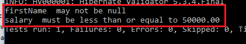

### Bean Validation ###
The Java API(`javax.validation.constraints`) for JavaBeans Validation (Bean Validation) provides a mechanism for validating application data.
Bean Validation specification JSR No 303 and introduce from jdk 6

Prior to JSR 303, you probably would have needed a bunch of if-else statements to achieve the bean validation.It saves lot of code.

reference implementation of 303 namely `Hibernate Validator`

JSR 349 extend jsr 303 provides for variable interpolation, allowing expressions inside the violation messages

reference implementation of 309 namely `GlassFish el`
 
### Warmup ###

1. create maven java project by following command

	`mvn archetype:generate -DgroupId=com.javaaround -DartifactId=Jpa -DarchetypeArtifactId=maven-archetype-quickstart -DinteractiveMode=false`

2. Update AppTest.java
	```java
	package com.javaaround;

	import org.junit.Test;;

	
	/**
	 * Unit test for simple App.
	 */
	public class AppTest {
	   @Test
	   public void AppTest( ){
	        App.main(null);
	   }
	}
	```

3. Update junit version at pom.xml

	```xml
	<version>4.8.1</version>
	```

4. Run app by following command

	`mvn clean package`


### Example Demo ###

1. Add hibernate-validator(provide also Bean Validator API) at pom.xml
	```xml
	<!-- 
	No need because it is included hibernate-validator
	<dependency>
	    <groupId>javax.validation</groupId>
	    <artifactId>validation-api</artifactId>
	    <version>1.1.0.Final</version>
	</dependency> 
	-->
	<dependency>
	    <groupId>javax.el</groupId>
	    <artifactId>javax.el-api</artifactId>
	    <version>2.2.4</version>
	</dependency>
	<dependency>
	    <groupId>org.hibernate</groupId>
	    <artifactId>hibernate-validator</artifactId>
	    <version>5.3.4.Final</version>
	</dependency>
	<!-- Needed by hibernate-validator to substitute params in messages: -->
	<dependency>
	    <groupId>org.glassfish.web</groupId>
	    <artifactId>javax.el</artifactId>
	    <version>2.2.4</version>
	    <scope>runtime</scope>
	</dependency>
	```

2. Create a bean(Employee.java)

	```java
	package com.javaaround.model;
	import javax.validation.constraints.DecimalMax;
	import javax.validation.constraints.NotNull;
	import javax.validation.constraints.Size;

	public class Employee { 
	    private int id;

	    @NotNull
	    @Size(max = 25,min = 5)  
	    private String firstName;
		@DecimalMax(value = "50000.00")
	    private Double salary;  

	    
	}   
	``` 

	Explantion :
 
	1. @NotNull :

		The value of the property must not be null.Unfortunately it doesn't check for empty string values.For this reason hibernate introduce two new contraints(not yet JPA)

		1. @NotBlank :  The string is not null and the trimmed length is greater than zero.
		2. @NotEmpty : The String, Collection, Map or Array object is not null and size > 0.

		```java
		String name = "";
		@NotNull: true
		@NotEmpty: false
		@NotBlank: false

		but 

		String name = " "; //space
		@NotNull: true
		@NotEmpty: true
		@NotBlank: false
		```

		@Null : The value of the property must be null.


	2. @Size :

		1. If the property is a String, the size of the string is evaluated. 
		2. If the property is a Collection, the size of the Collection is evaluated. 
		3. If the property is a Map, the size of the Map is evaluated. 
		3. If the property is an array, the size of the array is evaluated.

		Use one of the optional `max or min` elements to specify the boundaries.

	3. @DecimalMax :

		The value of the property must be a decimal value lower than or equal to the number in the `value` element. Similarway `@Max` for interger

	4. @DecimalMin :

		The value of the property must be a decimal value greater than or equal to the number in the `value` element.	Similarway `@Min` for interger

	Note : if the class uses field access type, apply the Bean Validation constraint annotations on the class’s fields. If the class uses property access, apply the constraints on the getter methods.

3. Update App.java

	```java
	Employee employee = new Employee();
	employee.setId(122);
	employee.setSalary(60000.00);
	ValidatorFactory factory = Validation.buildDefaultValidatorFactory();
	Validator validator = factory.getValidator();
	
	Set<ConstraintViolation<Employee>> constraints = validator
		.validate(employee);
	if (constraints.isEmpty()) {
		System.out.print("valid data");
	}else{	
		for (ConstraintViolation<Employee> constraint : constraints) {
			System.out.println(constraint.getPropertyPath() + "  "
			+ constraint.getMessage());
		}
	}
	```

4. Run app

 


### @AssertTrue,@Future,@Past ###

1. Update Employee.java

	```java
	@AssertTrue
	boolean active; 

	@Future
	Date arrageDate;

	@Past
	Date birthday;
	```


	Explantion :
 
	1. @AssertTrue :
		The value of the property must be true where as <br>@AssertFalse The value of the property must be false

	2. @Past : 
		The value of the property must be a date in the past.
	3. @Future : 
		The value of the property must be a date in the future.

2. Update App.java

	```java
	employee.setActive(false);
	try {
	 	employee.setArrageDate(new Date());
	    employee.setBirthday(formatter.parse("2017-04-02"));

	} catch (ParseException e) {
	    e.printStackTrace();
	}
			
	```	

Run app

 


### @Digits,@Pattern ###

1. Update Employee.java

	```java
	//Age can only be 2 digits long or less
	@Digits(integer=2, fraction=0)
	private int age;

	@Pattern(regexp=".+@.+\\.[a-z]+")
	private String email;
	```

	Explantion :
	 
	1. @Digits : 
			The value of the property specifies the maximum `integer` digits and `fraction` element specifies the maximum fractional digits for the number.

	2. @Pattern : 
			The value of the field or property must match the regular expression defined in the `regexp` element.

2. Upadate App.java

	```java
	employee.setAge(100);
	employee.setEmail("shamim.ict0754gmail.com");
	```

Run app

 


### Customizing Validator Messages ###

Update Employee.java

```java
//Age can only be 2 digits long or less
@Digits(integer=2, fraction=0,message="Age must be 2 digits long or less")
private int age;

@Pattern(regexp=".+@.+\\.[a-z]+",message="invalid email")
private String email;
```

Message parameters are string literals enclosed in {contraint param}  e.g {integer} for @Digits

message expressions are string literals enclosed in ${expression}  e.g {integer  > 1 ? 's' : ''}

`${validatedValue}` is a special expression that retrive value

Update Employee.java

```java
@Digits(integer=2, fraction=0,message="${integer  > 1 ? 's' : ''} must be {integer} digits long or less")
private int age;

@Pattern(regexp=".+@.+\\.[a-z]+",message="email.invalid")
private String email;
```

### Separting message from java ###

you can separting message into file(ValidationMessages.properties) from java code.this file contains message-key = message

1. Update Employee.java

	```java
	//Age can only be 2 digits long or less
	@Digits(integer=2, fraction=0)
	private int age;

	@Pattern(regexp=".+@.+\\.[a-z]+",message="{error.invalid_email}")
	@NotNull(message="{error.required}")
	private String email;
	```

	Explantion :
		 
	1. @Digits : 
		if you don't specify message key then it search `message key/message` by <br>following format contraints-namewithpackage.message<br>(e.g javax.validation.constraints.Digits.message)

	2. @Pattern & @NotNull: 
		since here define message key then it search that key into ValidationMessages.properties

2. Create ValidationMessages.properties at src/main/resources

	```properties
	javax.validation.constraints.Digits.message=Age must be 2 digits long or less
	error.invalid_email=Email mustss be match {regexp}
	error.required=Email can't null
	```

Run app	

Default file named ValidationMessages.properties is loaded if you need other name file e.g message.properties

Update App.java

```java
/*ValidatorFactory factory = Validation.buildDefaultValidatorFactory();
Validator validator = factory.getValidator();*/
Validator validator = Validation.byDefaultProvider()
.configure()
.messageInterpolator(
		new ResourceBundleMessageInterpolator(
				new PlatformResourceBundleLocator( "messages" )
		)
)
.buildValidatorFactory()
.getValidator();
```

For Multiple file load

```java
Validator validator = Validation.byDefaultProvider()
		.configure()
		.messageInterpolator(
				new ResourceBundleMessageInterpolator(
						new AggregateResourceBundleLocator(
								Arrays.asList(
										"MyMessages",
										"MyOtherMessages"
								)
						)
				)
		)
		.buildValidatorFactory()
		.getValidator();
```

